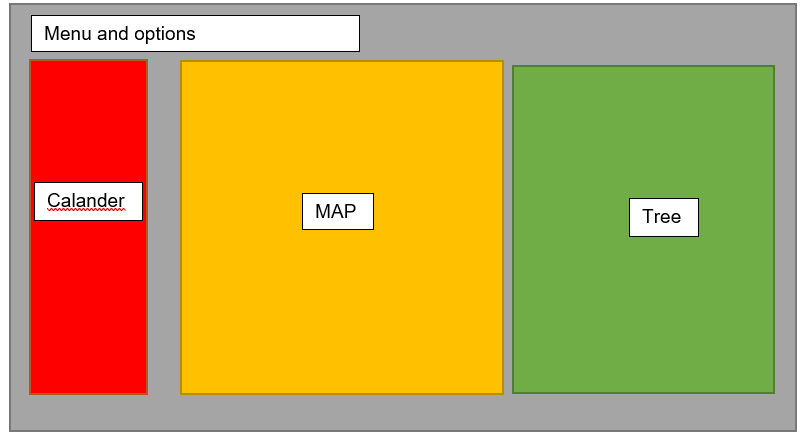

# Final project for Minor programming

###visualisations:
 * Custom map
 * Calander view of upload freqency
 * Tree visualisation of neighbourhood arrangement in Amsterdam.
 * Small graphs of trends

Of course they are linked, showing when stuff is uploaded and all room information.

Probably only for amsterdam, since more features are more impressive then more cities. Flask backend, own server, python preprocessing, d3 visuals, map + street view --> average for the month, histogram for room size, scatter plot for roomsize and price. and many more.

# Components
* Ubuntu server running Apache2 with multiple docker containers, connected by a reversed proxy.
* Scraper targeted at Kamernet.nl, scraping hourly. (running on the server)
* MySQL database running on the server
* RESTful API with +10 calls, also running on the server
* The main [site](http://app.foknet.nl/) with 7 pages.

# Data

Sources:
* [Kamernet](https://kamernet.nl/)
* [Gemeente](http://data.amsterdam/)
* [Instagram](https://www.instagram.com/developer/)

Data is scraped from kamernet, parsed into DataFrames with collums like, loaction, rent, size, furnitured, start data and up-time.
De Data from Asmterdam is mostly .xlxs files wich need to be cleaned and merged.
The insta data is retrieved by API, to retrive local pictures.

# D3 blocks

For the visualisation part I'm using the D3 Libarie. A few pieces of code will function as examples.
* [Tide tree](https://observablehq.com/@d3/tidy-tree)
* [Calander view](http://bl.ocks.org/oyyd/859fafc8122977a3afd6)
* [Map](http://bl.ocks.org/JulesBlm/918e2987805c7189f568d95a4e8855b4)

