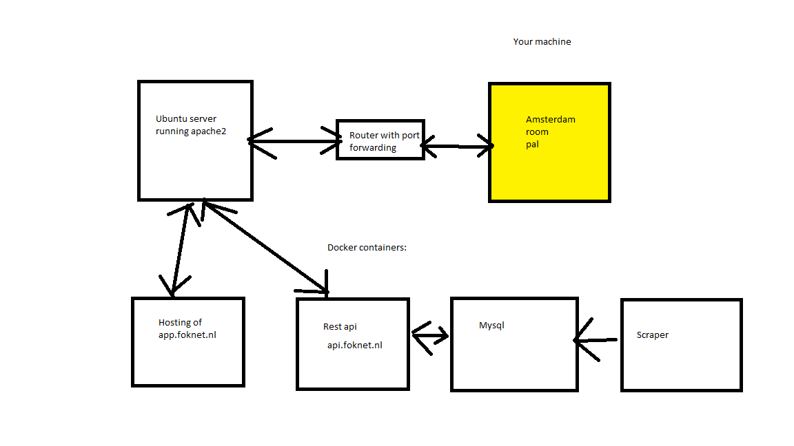

# The report

### The backend works as followed

The Server is connected by the router to a domain of transIP. Apache2 is running in the server which acts as a reverse proxy. This means that the sender doesn't know were the server is, but gets the correct data. Normally a proxy protects the sender, but in the reverse proxy the reciever is protected.

<u>The Ubuntu server contains some dockers:</u>
* MySQL
* Scaper
* RESTful API
* Site files

<u>The SQL database consist of three tables:</u>
* kamernet tabel; for all the room info
* kmaernet_log; for all the extra info, such as number of new uploads
* kamernet_sms; for the list of numbers which needs to be notified (has the posibility for preferece extention)

<u>The RESTful API</u> 
A representational state transfer api. Is in fact the brain of the project. Here is most data formatted and all data extracted from the databases. The api has more than 10 calls, which all retrieve different data.

<u>The scraper</u> 
Is schedualed every hour and parses the data, which it saves in the mysql databases. Also logs other useful info and sends text (if there are any credits...) 

<u>The site</u>
contains 7 htmls, some data and few javascripts. The following htlms are there:
* Home page
* Visualization page
* sms service page
* Api request page
* Data base to table page
* predict price page
* contact page
All pages are pretty self explanetory.

### the visuals

There are four visuals, one main view, two linked and one extra. All give info about the boring data from kamernet. All is better then the boring 
